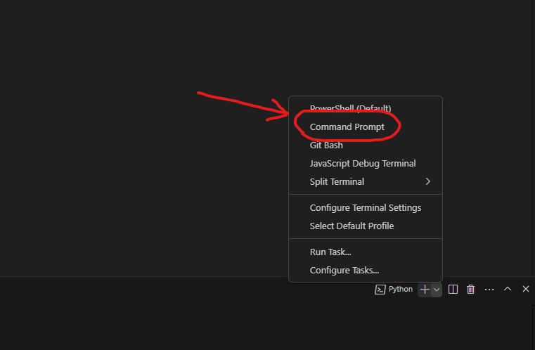
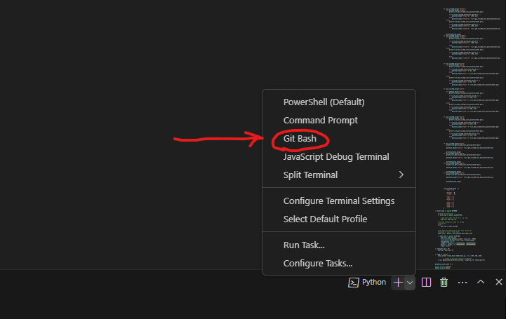
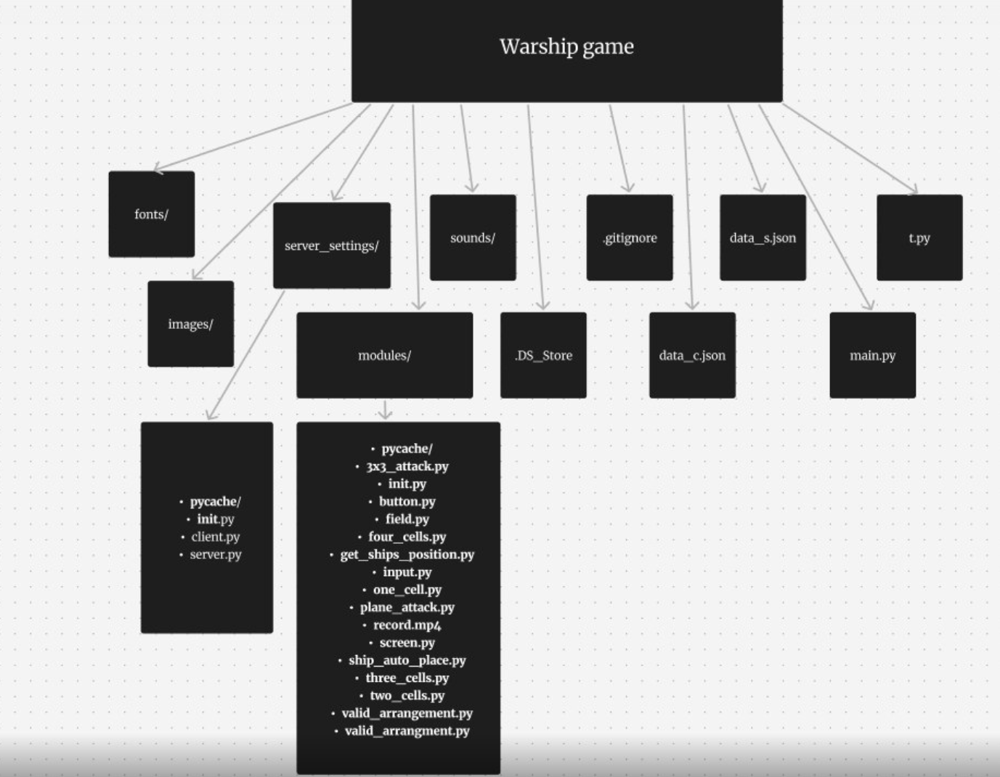

# Project game - "Warship Battle"

_Наш проект - це гра "Морський бій" яка дає змогу пограти зі своїм другом по мережі інтернет, та насолодитися процесом вашого просування у грі! Ви можете не тільки розташовувати кораблі та перемагати над суперником, а получати монети, за які можете купувати доповнення у магазині, що значно скращить процесс вашої гри разом із другом!_

---


### ALL INFORMATION

- [How to use](#how-to-use)

- [How to start](#how-to-start)

- [About us](#about-us)

- [Contacts of our team](#contacts-of-our-team)

- [Technologies that we used](#technologies-that-we-used)

- [New expirience](#new-expirience)

---

# How to use

### Windows:

1. >git clone https://github.com/dimachep1408/Warship_game.git
2. >python -m venv venv
3. >open command prompt terminal (cmd) 
4. > venv\scripts\activate.bat
2. >pip install -r requirements.txt
3. > python main.py
  
### Mac:

1. >git clone https://github.com/dimachep1408/Warship_game.git
2. >python3 -m venv venv
3. >open git-bash terminal 
4. > venv\bin\activate.bat
2. >pip3 install -r requirements.txt
3. > python main.py
  


# How to start

1. Перед нажаттям кнопки якщо підключаєтеся, обов'язково укажить айпі адресу напечатав її на клавіатурі/Before starting the game you are connecting to, be sure to indicate the IP address by typing it on the keyboard

1. >Click on the button you want: Create game, or Join game. / Натисніть на ту кнопку, яку хочете: Створити гру, або Приєднатися до гри.
2. >After you saw a menu with ships and grid, place them where you want, or lust use "auto" button. / Після того, що ви побачили меню з кораблями та полем, розташуйте їх де хочете, або ж просто натисніть на кнопку "auto".
3. >Click on "submit" button and wait till your opponent joins you. / Натисніть на кнопку "submit" та чекайте поки ваш оппонент не приєднається.
4. >Play the game peacefully with your friend. Make coins by killing the ships and buy stuff in the shop! / Грайте у гру з насолодою зі своїм другом. Получайте коїни з вбивання кораблів та покупайте доповення у магазині!

---

# About us

1. Dmytro Chepikov - Team lider, Code writer; / Тімлід, писатель коду;
2. Dmytro Lomako - Code writer; / Писатель коду;
3. Arina - Designer; / Дизайнер;
4. Polina - Designer; / Дизайнер;

---

# Contacts of our team

1. GitHub - [Dmytro Chepikov](https://github.com/dimachep1408)
2. GitHub - [Dmytro Lomako](https://github.com/DmytroLomako)
3. GitHub - [Arina](https://github.com/PotapenkoArina)
4. GitHub - [Polina](https://github.com/HoworukhaPolina)

---

# Technologies that we used

1. >Python - main language, on what we writed all our code for this game. / головний язик, на якому був написаний увесь наш код до гри.
2. >Figma - we used it for creating the structure of our game. / ми використовували це для створення структури до нашої гри.

# Modules that we used

1. > pygame <br/> <br/> pygame Це ігрвий двіжок на якому ми і здійснювали всі відображаємі елементи, віконце, та інше
2. >socket <br/> <br/> socket ми використовували для здійснення онлайн гри, скидували інформацію про нажату комірку на полі, та взагалі все що стосуєтся онлайн гри ми робили саме через цей модуль
3. >io <br/> <br/> io це бібліотека яка допомагає перетворювати інформацію на байт код та наоборот, ми його використовували для шифрації та дешифрації тексту перед відправкою

4. >os <br/> <br/> os ми використовували для свторення корректних путів
5. >pillow <br/> <br/> Картинки та їх редагування 

---

# Code pieces 

1. __connecting client to our server:__

``` python
import socket
import io
import threading
import time, ast, json, os

data_turn = {}
path_to_json = os.path.abspath(__file__ + "/../../data_c.json")
connected = False


def connect_client(ip = None, port = None):
    global connected, client_socket, position_enemy_ships, data_turn, attack_3x3_position
    client_socket = socket.socket(family= socket.AF_INET, type = socket.SOCK_STREAM)

    client_socket.connect((ip, port))

    data_turn['turn'] = False
    with open(path_to_json, "w") as f:
        json.dump(data_turn, f, indent = 4)

    attack_3x3_position = None

    print("server connected")

    def getting_message(): 
        print("work")
        global position_enemy_ships, data_turn, position_shot, flag_send_message, rotation_enemy_ships, closed, attack_3x3_position, aimed_strike_position
        while True: 
            try: 
                data = client_socket.recv(1024).decode()
                flag_send_message = True
                print(data) 
                if 'position' in data:
                    position_enemy_ships = ast.literal_eval(data.split('/')[-1])
                    print(type(position_enemy_ships))
                elif 'rotation' in data:
                    rotation_enemy_ships = ast.literal_eval(data.split('/')[-1])
                elif 'turn' in data:
                    data_turn['turn'] = True
                    with open(path_to_json, "w") as f:
                        json.dump(data_turn, f, indent = 4)
                elif 'attack_3x3' in data:
                    attack_3x3_position = ast.literal_eval(data.split('/')[-1])
                    print(attack_3x3_position)
                elif 'aimed_strike' in data:
                    aimed_strike_position = list(ast.literal_eval(data.split('/')[-1]))
                    print(aimed_strike_position)
                elif "/" in data:
                    position_shot = ast.literal_eval(data.split("/")[-1])
                    print(position_shot)
                elif "!" in data:
                    closed = True
                elif ":" in data:
                    list_pvo_protect_sends = data
            except Exception as e: 
                print(f"work - {e}")
                return data
            time.sleep(0.2)

    threading.Thread(target = getting_message).start()


    connected = True
```
* >This code contsins connecting client with our server. We used only classes and lists.
* >Цей код містить у собі підключення клієнта до сервера. Ми використовували лише класи та списки.


2. __field:__

``` python
import pygame, os
from modules.button import Button

class Field():
    def __init__(self, width = 500, height = 500, color = "light gray", dest = (0, 0)):
        self.dest = dest
        self.field_surf = pygame.Surface((width, height))
        self.field_surf.fill(color)
        self.draw_grid()
        self.circle = os.path.abspath(__file__ + "/../../images/circle.png")
        self.circle = pygame.transform.scale(pygame.image.load(self.circle), (50, 50))
        self.cross = os.path.abspath(__file__ + "/../../images/cross.png")
        self.cross = pygame.transform.scale(pygame.image.load(self.cross), (50, 50))
        self.target = os.path.abspath(__file__ + "/../../images/target.png")
        self.target = pygame.transform.scale(pygame.image.load(self.target), (50, 50))
    def draw_grid(self):
        for i in range(10):
            for j in range(10):
                cell = Button(
                    self.field_surf,
                    color = "black",
                    position = (i * 50, j * 50),
                    size = (50, 50),
                    border_size = 1,
                )

    def get_clicked_cell(self, mouse_pos, enemy = False):
        x, y = mouse_pos
        i = (x - self.dest[0]) // 50
        j = (y - self.dest[1]) // 50
        if enemy:
            i += 2
        if 0 <= i < 10 and 0 <= j < 10:
            return (i, j)
        return None
    
    def get_clicked_cell_position(self, mouse_pos):
        x, y = mouse_pos
        i = (x - self.dest[0]) // 50
        j = (y - self.dest[1]) // 50
        if 0 <= i < 10 and 0 <= j < 10:
            pixel_x = self.dest[0] + i * 50
            pixel_y = self.dest[1] + j * 50
            return (pixel_x, pixel_y)
        return None

    def matrix_fill(self, matrix, cells_count, ship_coordinates, rotation_ship):
        if rotation_ship == 1:
            for i in range(cells_count):
                try:
                    x, y = ship_coordinates
                    x = (x - self.dest[0]) // 50 + 1
                    y = (y - self.dest[1]) // 50 + 1
                    matrix[y][x + i] += 2
                except:
                    pass
                
            for i in range(cells_count):
                try:
                    matrix[y + 1][x + i] += 3
                    matrix[y - 1][x + i] += 3
                except:
                    pass
            for i in range(3):
                try:
                    i -= 1
                    matrix[y + i][x + cells_count] += 3
                    matrix[y + i][x - 1] += 3
                except:
                    pass
        elif rotation_ship == 0:
            for i in range(cells_count):
                try:
                    x, y = ship_coordinates
                    x = (x - self.dest[0]) // 50 + 1
                    y = (y - self.dest[1]) // 50 + 1
                    matrix[y + i][x] += 2
                except:
                    pass
            for i in range(cells_count):
                try:
                    matrix[y + i][x + 1] += 3
                    matrix[y + i][x - 1] += 3
                except:
                    pass
            for i in range(3):
                try:
                    i -= 1
                    matrix[y + cells_count][x + i] += 3
                    matrix[y - 1][x + i] += 3
                except:
                    pass
            
    def click(self, list_ships, screen, mouse_pos = None, column = None, row = None):
        hit = False
        if mouse_pos != None:
            column, row = self.get_clicked_cell(mouse_pos)

        if list_ships[row][column] % 3 == 0:

            screen.blit(self.circle, ((column + self.dest[0] // 50) * 50, (row + self.dest[1] // 50) * 50))
        elif list_ships[row][column] == 2:
            hit = True
            screen.blit(self.cross, ((column + self.dest[0] // 50) * 50, (row + self.dest[1] // 50) * 50))
        return hit
    def fill_after_destroy(self, matrix, ship_size, position, rotation, screen):

        row, column = self.get_clicked_cell(position, enemy = True)
        if rotation:
            for i in range(ship_size):
                print('row')
                if column != 9:
      
                    screen.blit(self.circle, ((row + i + self.dest[0] // 50) * 50, (column + 1 + self.dest[1] // 50) * 50))
                if column != 0:
             
                    screen.blit(self.circle, ((row + i + self.dest[0] // 50) * 50, (column - 1 + self.dest[1] // 50) * 50))
            if row != 0:
    
                screen.blit(self.circle, ((row - 1 + self.dest[0] // 50) * 50, (column + self.dest[1] // 50) * 50))
                if column != 9:
               
                    screen.blit(self.circle, ((row - 1 + self.dest[0] // 50) * 50, (column + 1 + self.dest[1] // 50) * 50))
                if column != 0:
               
                    screen.blit(self.circle, ((row - 1 + self.dest[0] // 50) * 50, (column - 1 + self.dest[1] // 50) * 50))
            if row + ship_size != 10:
           
                screen.blit(self.circle, ((row + ship_size + self.dest[0] // 50) * 50, (column + self.dest[1] // 50) * 50))
                if column != 9:

                    screen.blit(self.circle, ((row + ship_size + self.dest[0] // 50) * 50, (column + 1 + self.dest[1] // 50) * 50))
                if column != 0:

                    screen.blit(self.circle, ((row + ship_size + self.dest[0] // 50) * 50, (column - 1 + self.dest[1] // 50) * 50))
        else:
            for i in range(ship_size):
                print('column')
                if row != 9:

                    screen.blit(self.circle, ((row + 1 + self.dest[0] // 50) * 50, (column + i + self.dest[1] // 50) * 50))
                if row != 0:
                  
                    screen.blit(self.circle, ((row - 1 + self.dest[0] // 50) * 50, (column + i + self.dest[1] // 50) * 50))
            if column != 0:
                
                screen.blit(self.circle, ((row + self.dest[0] // 50) * 50, (column - 1 + self.dest[1] // 50) * 50))
                if row != 9:
                    
                    screen.blit(self.circle, ((row + 1 + self.dest[0] // 50) * 50, (column - 1 + self.dest[1] // 50) * 50))
                if row != 0:
                   
                    screen.blit(self.circle, ((row - 1 + self.dest[0] // 50) * 50, (column - 1 + self.dest[1] // 50) * 50))
            if column + ship_size != 10:
                
                screen.blit(self.circle, ((row + self.dest[0] // 50) * 50, (column + ship_size + self.dest[1] // 50) * 50))
                if row != 9:
                    
                    screen.blit(self.circle, ((row + 1 + self.dest[0] // 50) * 50, (column + ship_size + self.dest[1] // 50) * 50))
                if row != 0:
                    
                    screen.blit(self.circle, ((row - 1 + self.dest[0] // 50) * 50, (column + ship_size + self.dest[1] // 50) * 50))
    def attack_3x3(self, matrix, screen, mouse_pos = None, position_attack = None):
        if mouse_pos != None:
            row, column = self.get_clicked_cell(mouse_pos)
        elif position_attack != None:
            column, row = position_attack
        column_range = 3
        row_range = 3
        column_subtract = 1
        row_subtract = 1
        if row == 0:
            row_range -= 1
            row_subtract = 0
        if column == 0:
            column_range -= 1
            column_subtract = 0
        for i in range(column_range):
            for j in range(row_range):
                try:
                    if matrix[column - column_subtract + i][row - row_subtract + j] % 3 == 0:
                        
                        screen.blit(self.circle, ((row - row_subtract + j + self.dest[0] // 50) * 50, (column - column_subtract + i + self.dest[1] // 50) * 50))
                    elif matrix[column - column_subtract + i][row - row_subtract + j] == 2:
                        
                        screen.blit(self.cross, ((row - row_subtract + j + self.dest[0] // 50) * 50, (column - column_subtract + i + self.dest[1] // 50) * 50))
                except IndexError:
                    pass
        return (column, row)
    def aimed_strike(self, matrix, screen, mouse_pos):
        row, column = self.get_clicked_cell(mouse_pos)
        hit = f'circle%({(row + self.dest[0] // 50) * 50, (column + self.dest[1] // 50) * 50})'
        screen.blit(self.target, ((row + self.dest[0] // 50) * 50, (column + self.dest[1] // 50) * 50))
        if matrix[column][row] == 2:
            hit = f'cross%({(row + self.dest[0] // 50) * 50, (column + self.dest[1] // 50) * 50})'
            
        return hit
```

* >This code is needed so that the user can interact with the field in the game.
* >Цей код потрібен щоб користувач міг контакутувати с полем у грі


3. __Button:__

``` python
import pygame
import os

class Button():
    def __init__(self, surface, position = (0, 0), color = "gray", border_size = 0, size = (150, 75)):
        
        self.button_rect = pygame.Rect(position[0], position[1], size[0], size[1])
        self.button_surf = surface
        self.position = position
        pygame.draw.rect(surface, color = color, rect = self.button_rect, width = border_size, border_radius= 5)

        self.x = position[0]
        self.y = position[1]
    def Font(self, color = "white", text = "Hello", font_size = 24):
        
        self.font = pygame.font.Font(os.path.abspath(__file__ + "/../../fonts/Oswald-Medium.ttf"), font_size)
        self.text = self.font.render(f"{text}", True, color)
        
    def button_clicked(self, mouse_position):

        

        return self.button_rect.collidepoint(mouse_position)
```

* >This code is a Button Class which contains text creation and also checks for a pressed button
* >Цей код є Класом кнопки у якому є створення текста а також перевірка на нажату кнопку


5. __Ships:__

``` python
import pygame
import os

class FourCellsShip():
    def __init__(self, matrix_x, x, y, rotation=True, screen = None, area = None, killed = False):
        

        if killed:
            self.ship_surf = pygame.image.load(os.path.abspath(__file__ + "/../../images/four_cells_ship_killed.png"))
        else:
            self.ship_surf = pygame.image.load(os.path.abspath(__file__ + "/../../images/4_cells_ship.png"))

       
        self.ship_surf = pygame.transform.scale(self.ship_surf, (195, 45))

        
        if not rotation:  
            self.ship_surf = pygame.transform.rotate(self.ship_surf, 90) 

        self.ship_rect = self.ship_surf.get_rect()


        self.ship_rect.topleft = (x, y)

        self.matrix_x = matrix_x
        self.rotation = rotation
        self.screen = screen
        self.area = area
  
        self.x = x
        self.y = y
        
        
    def rotate_down(self):

        self.ship_surf = pygame.transform.rotate(self.ship_surf, 90)
        
        

    def get_clicked(self, mouse_position):

        return self.ship_rect.collidepoint(mouse_position)
```

* >This code is a 4-cell ship class with ship rotation and button press check, our code represents similar classes of three, two and one-cell ships
* >Цей код є Класом корабля на 4 клітинки с функцієй повороту корабля та перевіркою на нажату кнопку, наш код представляє аналогічні класи трех двух та одно клітинні кораблі


6. __get_clicked_cell_position:__

``` python

import pygame


def get_ships_position(matrix : dict, return_position_ships = True):
    
    rotation_ships_dict = {
        "four" : 1,

        "three1" : 1,
        "three2" : 1,
        
        "two1" : 1,
        "two2" : 1,
        "two3" : 1,

        "one1" : 1,
        "one2" : 1,
        "one3" : 1,
        "one4" : 1,
    }
    
    position_ships_dict = {
        "four" : (100, 50),

        "three1" : (50, 115),
        "three2" : (210, 115),
        
        "two1" : (35, 175),
        "two2" : (155, 175),
        "two3" : (275, 175),

        "one1" : (25, 250),
        "one2" : (125, 250),
        "one3" : (225, 250),
        "one4" : (325, 250),
    }


    writed_ships = {

        "three1" : 1,
        "three2" : 1,
        
        "two1" : 1,
        "two2" : 1,
        "two3" : 1,

        "one1" : 1,
        "one2" : 1,
        "one3" : 1,
        "one4" : 1,
    }


    row_count = 0
    number_count = 0
    

    for row in matrix:
        for number in row:
            if number == 2:


                try:
                    if matrix[row_count][number_count + 1] == 2 or matrix[row_count + 1][number_count] == 2:
                        pass
                except:
                    pass
                else:

                    if writed_ships["one4"] and writed_ships["one1"] == 0 and writed_ships["one2"] == 0 and writed_ships["one3"] == 0:
                        position_ships_dict["one4"] = (row_count, number_count)
                        writed_ships["one4"] = 0

                    if writed_ships["one3"] and writed_ships["one1"] == 0 and writed_ships["one2"] == 0:
                        position_ships_dict["one3"] = (row_count, number_count)
                        writed_ships["one3"] = 0

                    if writed_ships["one2"] and writed_ships["one1"] == 0:
                        position_ships_dict["one2"] = (row_count, number_count)
                        writed_ships["one2"] = 0


                    if writed_ships["one1"]:
                        position_ships_dict["one1"] = (row_count, number_count)
                        writed_ships["one1"] = 0
                    


                try:
                    if matrix[row_count][number_count + 2] == 2 or matrix[row_count + 2][number_count] == 2:
                        pass
                except:
                    pass
                else:                    
                    try:
                        if matrix[row_count][number_count + 1] == 2:
                            pass
                    except:
                        pass

                        if writed_ships["two3"] and writed_ships["two1"] == 0 and writed_ships["two2"] == 0:
                            rotation_ships_dict["two3"] = 0
                            position_ships_dict["two3"] = (row_count, number_count)
                            writed_ships["two3"] = 1  


                        if writed_ships["two2"] and writed_ships["two1"] == 0:
                            rotation_ships_dict["two2"] = 0
                            position_ships_dict["two2"] = (row_count, number_count)
                            writed_ships["two2"] = 1
                            

                        if writed_ships["two1"]:
                            print("work")
                            rotation_ships_dict["two1"] = 0
                            position_ships_dict["two1"] = (row_count, number_count)
                            writed_ships["two1"] = 1

                    try:
                        if matrix[row_count + 1][number_count] == 2:

                            if writed_ships["two3"] and writed_ships["two1"] == 0 and writed_ships["two2"] == 0:
                                rotation_ships_dict["two3"] = 0
                                position_ships_dict["two3"] = (row_count, number_count)
                                writed_ships["two3"] = 0    


                            if writed_ships["two2"] and writed_ships["two1"] == 0:
                                rotation_ships_dict["two2"] = 0
                                position_ships_dict["two2"] = (row_count, number_count)
                                writed_ships["two2"] = 0
                                

                            if writed_ships["two1"]:
                                print("work")
                                rotation_ships_dict["two1"] = 0
                                position_ships_dict["two1"] = (row_count, number_count)
                                writed_ships["two1"] = 0
                    except:
                        pass

                        


                            
                try:
                    if matrix[row_count][number_count + 3] == 2 or matrix[row_count + 3][number_count] == 2:
                        pass
                except:
                    pass
                else:                    
                    try:
                        if matrix[row_count][number_count + 1] == 2:

                            if writed_ships["two2"] and writed_ships["two1"] == 0:
                                rotation_ships_dict["two2"] = 0
                                position_ships_dict["two2"] = (row_count, number_count)
                                writed_ships["two2"] = 1
                                

                            if writed_ships["two1"]:
                                rotation_ships_dict["two1"] = 0
                                position_ships_dict["two1"] = (row_count, number_count)
                                writed_ships["two1"] = 1
                    except:
                        pass


                    try:
                        if matrix[row_count + 1][number_count] == 2:
                            
                            if writed_ships["two3"] and writed_ships["two1"] == 0 and writed_ships["two2"] == 0:
                                rotation_ships_dict["two3"] = 0
                                position_ships_dict["two3"] = (row_count, number_count)
                                writed_ships["two3"] = 0    


                            if writed_ships["two2"] and writed_ships["two1"] == 0:
                                rotation_ships_dict["two2"] = 0
                                position_ships_dict["two2"] = (row_count, number_count)
                                writed_ships["two2"] = 0
                                

                            if writed_ships["two1"]:
                                print("work")
                                rotation_ships_dict["two1"] = 0
                                position_ships_dict["two1"] = (row_count, number_count)
                                writed_ships["two1"] = 0
                    except:
                        pass
                        

                
            
            number_count += 1 
        row_count += 1
        number_count = 0


                    


    if return_position_ships:
        return position_ships_dict
    if not return_position_ships:
        return rotation_ships_dict
    


player_matrix = [
[2, 2, 2, 2, 6, 2, 6, 2, 3, 0],
[3, 3, 3, 3, 6, 2, 6, 2, 3, 0],
[3, 6, 3, 3, 3, 2, 6, 2, 3, 0],
[2, 6, 2, 6, 6, 6, 6, 3, 3, 0],
[2, 6, 2, 6, 2, 3, 0, 0, 0, 0],
[3, 6, 3, 6, 2, 3, 0, 0, 0, 0],
[3, 3, 6, 6, 9, 6, 6, 3, 3, 0],
[3, 2, 6, 2, 6, 2, 6, 2, 3, 0],
[3, 3, 6, 3, 6, 3, 6, 3, 3, 0],
[0, 0, 0, 0, 0, 0, 0, 0, 0, 0],
]

print(get_ships_position(matrix = player_matrix, return_position_ships= True))
print("")
print(get_ships_position(matrix = player_matrix, return_position_ships= False))
```


* >This code is needed to get the positions and orientations of ships from the matrix.
* >Цей код потрібен щоб получити позиції та орієнтацію кораблів з матриці

---
# Ships arrangment auto/manual

## auto

Автоматичну розашування кораблів ми зробили у останніх версіях гри, хоча ії розробка заняла меньше часу ніж ручна,

#### Алгоритм роботи авто-розташування:

1. > Використовування функції створення матриці з автоматично розтановленними кораблями, алеж матрицю ми не можемо перенести так просто у гру, і саме для цього ми створили функціюю отримки позицій та ориентації кораблів

2. > Використовування іншої функцій з отриманням координат та орієнтацію кораблів у матриці яку генерує перша функція

3. > Створити по рандомно створенним позиціям та поворотами 
кораблі у самій грі

## manual

З ручною розтановкою кораблів у нас не було величезних проблем, ми її зробили майже спочатку та вона працює на цьому алгоритмі

#### Алгоритм роботи ручного розташування

1. > Перевірка на нажатий корбель, якщо нажат до прикладу четвертий (чотирьохпалубний)

2. >Зміна значення нажатого корабля у словарі (якщо ліва клавиша миши буде віджата не у площі поля то змінюєтся назад)

3. > Зміна координат корабля у створенному словарі з координатами кораблів, якщо корабель нажат (значення у словарі з нажатими кораблями == 1 - нажато) тоді змінити значення координат цього корабля на координати курсора (передвигатися за курсором)

4. > Якщо корабель вілпустили на території поля то він підровнюєтся під ту клітинки над якою ви відпустили клавішу

# Weapons 

### In our game we added 3 weapons it's: <br/> 

* >3x3 bomb; <br/>
* >air strike <br/> 
* >aimed strike;

---

* >3x3 bomb kill all ships in 1 cells around cursor and clicked cell <br/>

* >air strike bomb 5 random cells <br/>

* >aimed strike : you choose 5 cells and shoot to they're

---

# Weapons

### У нашій грі ми додали 3 види зброї: <br/> 

* >3x3 бомба; <br/>
* >повітряний удар <br/> 
* >прицільний удар;

---

* >Бомба 3x3 вбиває всі кораблі в 1 клітинці навколо курсора та клацання клітинки <br/>

* >авіаційний удар взриває 5 випадкових клітин <br/>

* >прицільний удар: ви вибираєте 5 клітин і стріляєте в них

# Design & Graphics

Усі спрайти та малюнки що ви бачили у грі створено тількі нашими руками, використовуючи при цьому Photoshop та інші программи. Ми використовуємо тільки ті спрайти, які були зроблені нами! / All images you have seen in our game was made by our own hands, using Photoshop and other image editting apps. We used only our sprites that we created!

---

# Fonts

У цій грі ми використовували шрифт: Oswald-Medium,
він придає стилю брутальності до тексту, якраз у грі про битву кораблів/
In this game we used the font: Oswald-Medium,
it gives a brutal style to the text, just like in a game about a ship battle

# Project structure



# New expirience 

Коли ми працювали над створенням цієї гри, ми здобули багато нового досвіду і навчилися розробляти власну гру. Ми освоїли підключення гри до іншого гравця, створення її структури, механіки бою між гравцем і опонентом та багато іншого. За останні три місяці ми реалізували чимало ідей і освоїли навички, яких раніше не мали. Наша команда доклала максимум зусиль, щоб створити справді круту, працюючу гру, в яку можна грати. Ми щиро вдячні всією командою, особливо організаторам цього змагання! / When creating this game we got many new expirience and leaned how to create own game and how to join another person, how to make structure to our game, how to make the battle between you and opponent. Created really many things for the past three months, and learnt many things too. Our team was trying our best to make a really cool game, which would work without any mistakes. Saying thanks to all and to this competition!

---
